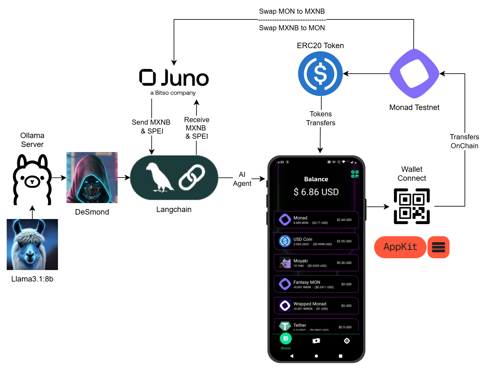
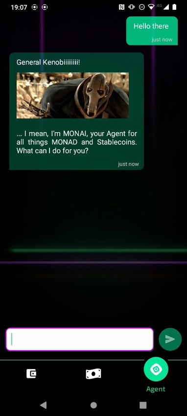
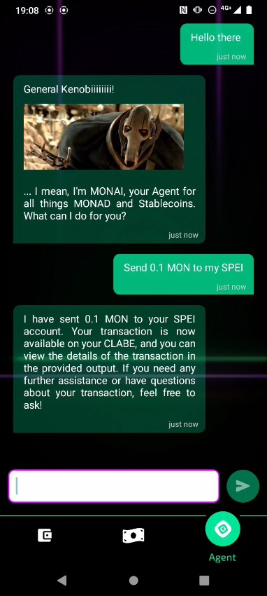
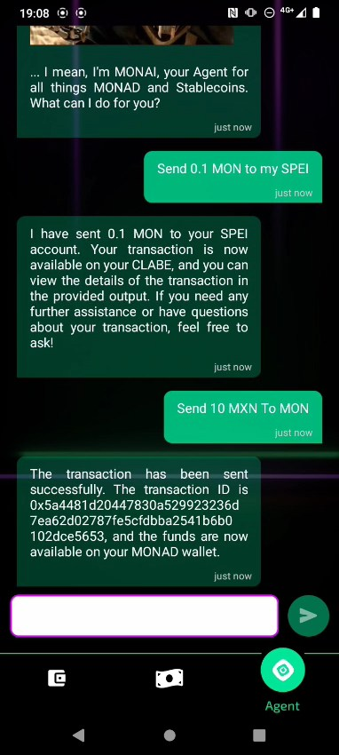
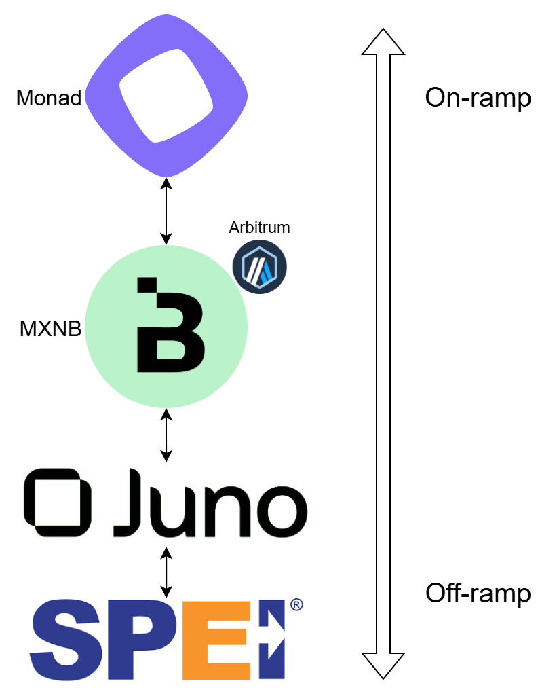
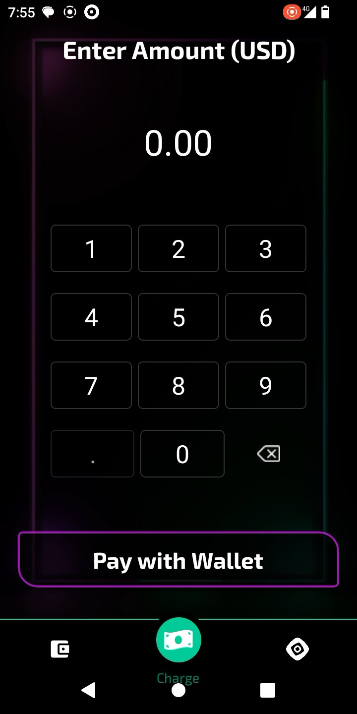
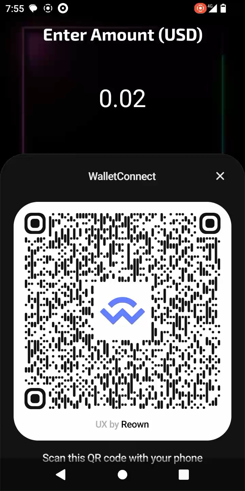
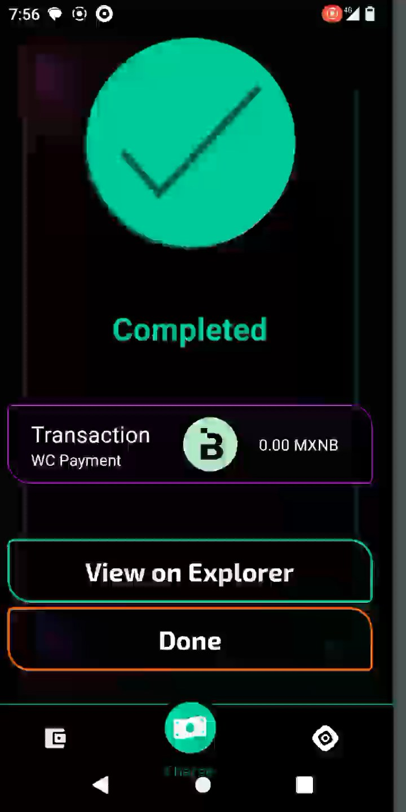

# Outlay

<p align="center">

<p>

Outlay revolutionizes digital payments by combining intelligent AI agents with seamless point-of-sale capabilities. Built on the **Monad** blockchain, our platform transforms complex crypto transactions into simple, conversational experiences. We're not just processing payments—we're creating an intelligent financial ecosystem where AI agents handle the complexity while you focus on what matters most: people. 

## 🔗 Fast Links

  - **APK:** [LINK](https://1drv.ms/f/c/cd37f27a646d3078/Ek-rbxSx_NROmWZY0LnDLX0B1nDOKEdX-l3OGqZi9I1sYA?e=NULVST)
  - **VIDEO DEMO:** [LINK](Pending.....)

## ⚙️ System Architectue & Tech Stack

Outlay is designed with a modern Web3 architecture that prioritizes intelligence, speed, and simplicity. Every component works together to create an experience that feels natural yet powered by cutting-edge blockchain technology and AI.



*(The system diagram illustrates how Outlay uses AI agents as intelligent helpers to manage crypto assets, facilitate on/off ramp services, and leverage WalletConnect integration to deliver a seamless payment experience across the Monad ecosystem.)*

### Core Components:

  - [**Monad**](https://monad.xyz/)
    Our blockchain of choice for its high-performance infrastructure and EVM-compatible architecture. Monad's parallel execution and optimized consensus make crypto payments feel instant and affordable, whether you're processing a single transaction or handling high-volume merchant operations.

  - [**Langchain (AI Agent)**](https://www.langchain.com/)
    The intelligence behind Outlay conversational interface. Instead of navigating complex wallet UIs, users can simply tell our AI what they want to do—"Send 10 MXN to my wallet on MON" or "Give me my MON balance"—and it handles the rest with context-aware responses.

  - [**Point-of-Sale Integration**](https://square.com/)
    Seamless integration with existing POS systems allows merchants to accept crypto payments without changing their workflow. Our system bridges traditional payment processing with blockchain technology.

## 🤖 AI Agent Integration

Outlay's AI agent transforms how users interact with their crypto wallets, making complex blockchain operations as simple as having a conversation.

  

### MONAI Agent Capabilities:

Meet **MONAI**, your intelligent crypto assistant that understands natural language and executes blockchain operations seamlessly:

  - **`get_balance_monad`**: Retrieves token balances for MONAD, USDT, and other supported tokens
  - **`transfer_to_spei`**: Converts MON from Monad Testnet to traditional SPEI bank transfers
  - **`transfer_to_monad`**: Brings MXN from SPEI into your Monad wallet as MON
  - **`list_of_tools`**: Shows available capabilities when users need guidance
  - **`fallback`**: Provides friendly responses and conversation flow

### On/Off Ramp Integration:

This integration enables seamless conversion from Monad testnet tokens to traditional banking through a multi-step process:



1. **Token Swap**: MON tokens on Monad Testnet are swapped to MXNB on Arbitrum Sepolia using our liquidity pool
2. **Juno Platform**: MXNB tokens are then sent to Juno for processing
3. **SPEI Transfer**: Juno handles the final conversion and executes the SPEI transfer to the user's CLABE account

Note: Juno operates in sandbox mode to simulate the complete flow from crypto to traditional banking infrastructure.

```javascript
const transferToSpei = tool(
  async ({ amount }, { configurable: { privateKey } }) => {
    const response = await fetchURL(process.env.MONAD_TO_SPEI, {
      amount,
      privateKey,
    });
    
    if (response === null) {
      return JSON.stringify({
        status: "error",
        message: "Transaction failed.",
      });
    }
    
    const { hash } = response;
    return JSON.stringify({
      status: "success",
      message: "Your transaction is available on your CLABE.",
      transaction: hash,
    });
  },
  {
    name: "transfer_to_spei",
    description: "Facilitates MON transfers from Monad Testnet to MXNB on Arbitrum Sepolia to a Spei CLABE account",
    schema: z.object({
      amount: z.string(),
    }),
  }
);
```

## 💳 Point-of-Sale Integration

Outlay seamlessly integrates with existing merchant infrastructure, allowing businesses to accept crypto payments without disrupting their current workflow.

  

### WalletConnect Integration

Our payment system uses **WalletConnect** via Reown's AppKit for seamless wallet connections on Monad Testnet:

```javascript
// WalletConnect Configuration
const monad = {
  chainId: 10143,
  name: "Monad Testnet",
  currency: "MON",
  explorerUrl: "https://monad-testnet.socialscan.io/",
  rpcUrl: "https://monad-testnet.g.alchemy.com/v2/",
};

createAppKit({
  projectId,
  metadata,
  chains: [monad],
  config,
  enableAnalytics: true,
});
```

### Connection Management

The payment interface manages wallet connections through a centralized `open` command system that handles different connection states:

```javascript
// Initiating WalletConnect Connection
onPress={() => {
  this.setState({ loading: true });
  this.props.open({ view: "ConnectingWalletConnect" });
}}

// Error Recovery - Reconnection Flow
this.props.isConnected && this.props.disconnect();
await this.setStateAsync({
  ...BaseStatePaymentWallet,
  amount: this.state.amount,
});
this.props.open({ view: "ConnectingWalletConnect" });
```

This approach ensures consistent connection handling across the app, with automatic error recovery and state management for interrupted transactions.

### Payment Processing Flow

The payment interface handles multiple token types and includes special MXNB integration for Mexican peso transactions:

```javascript
// Native MONAD Payment
async nativePayment(signer, index) {
  const amount = (this.state.amount / this.context.value.usdConversion[index])
    .toFixed(blockchain.tokens[index].decimals);
  const amountBN = parseUnits(amount, blockchain.tokens[index].decimals);
  
  const tx = await signer.sendTransaction({
    chainId: blockchain.chainId,
    to: this.context.value.address,
    value: amountBN,
  });
  
  await tx.wait();
  // Transaction complete with receipt generation
}

// ERC20 Token Payment
async tokenPayment(signer, index) {
  const token = new Contract(
    blockchain.tokens[index].address,
    abiERC20,
    signer
  );
  const amount = (this.state.amount / this.context.value.usdConversion[index])
    .toFixed(blockchain.tokens[index].decimals);
  const amountBN = parseUnits(amount, blockchain.tokens[index].decimals);
  
  const tx = await token.transfer(this.context.value.address, amountBN, {
    chainId: blockchain.chainId,
  });
  
  await tx.wait();
  // Transaction complete with receipt generation
}

// MXNB to SPEI Bridge
async mxnbPayment(signer, index) {
  const tx = await signer.sendTransaction({
    chainId: blockchain.chainId,
    to: "0xE5fC7cd34313488697CACf04E8AD01e9615668Ce",
    value: amountBN,
  });
  
  // Trigger off-ramp to Mexican banking system
  this.monadToSpei(amount);
}
```

### Key Features:

- **Multi-token Support**: Accept MONAD, USDT, and other ERC20 tokens
- **MXNB Integration**: Direct conversion to Mexican peso via SPEI banking and Juno
- **Real-time Balances**: Batch balance checking for optimal UX

## 📄 License

This project is licensed under the MIT License - see the [LICENSE](LICENSE) file for details.
